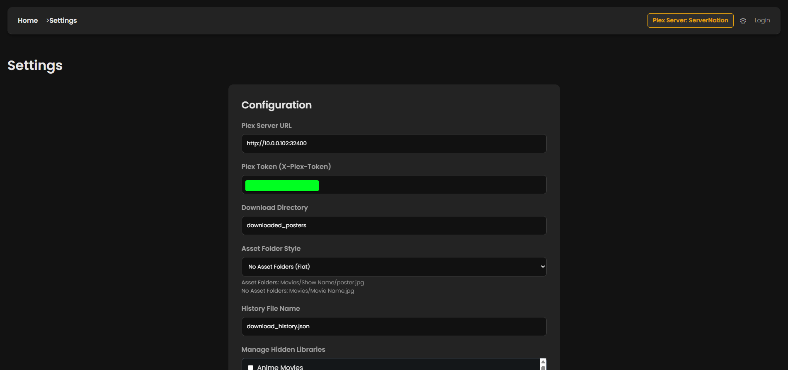
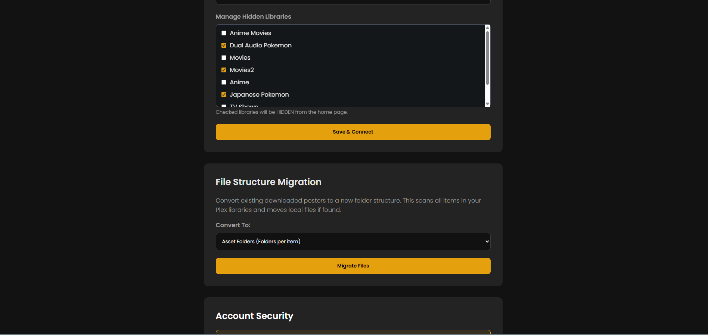
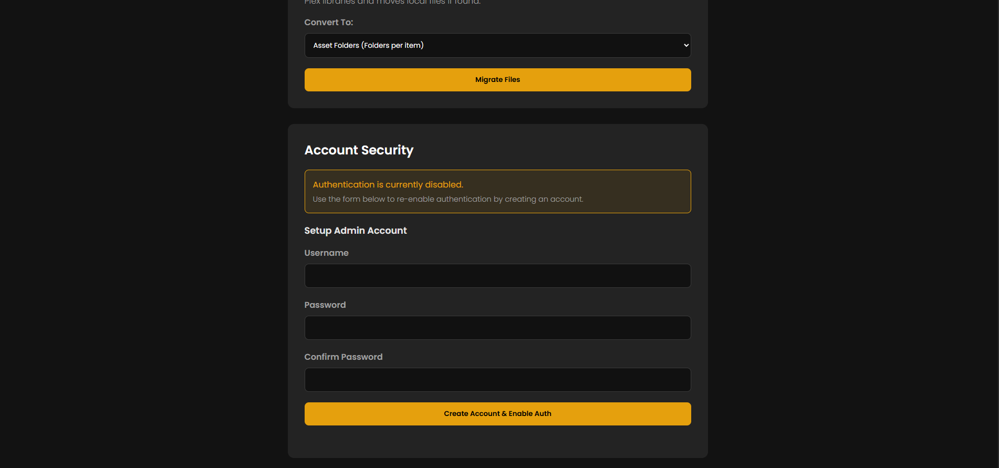
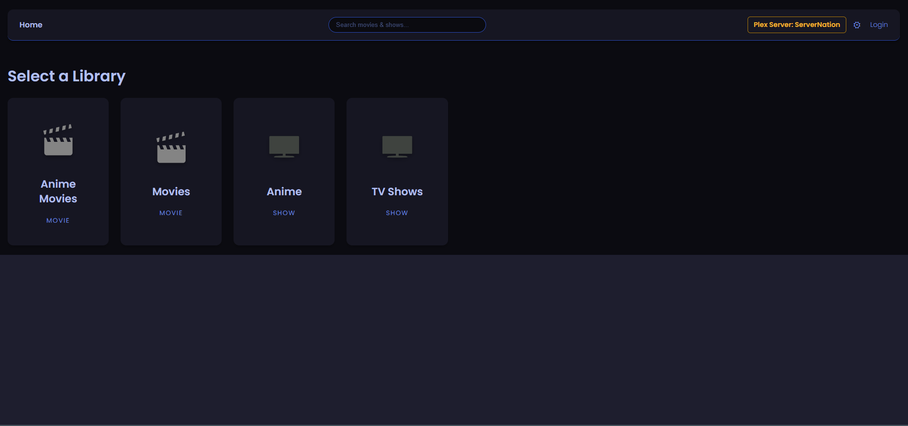
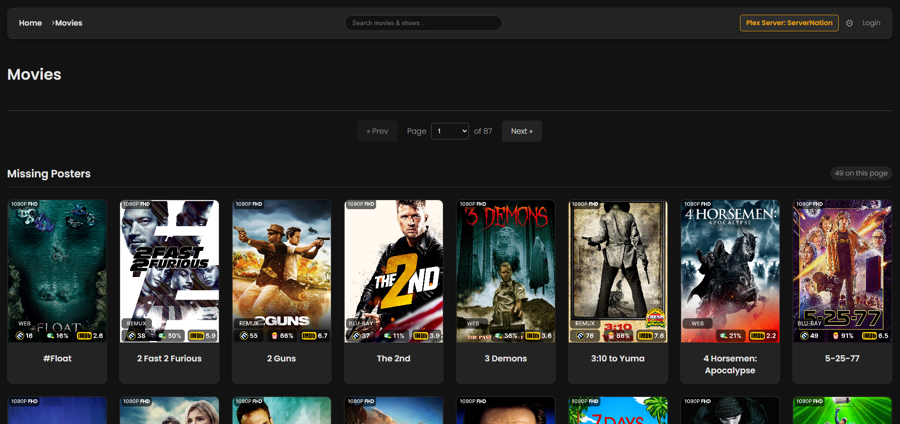
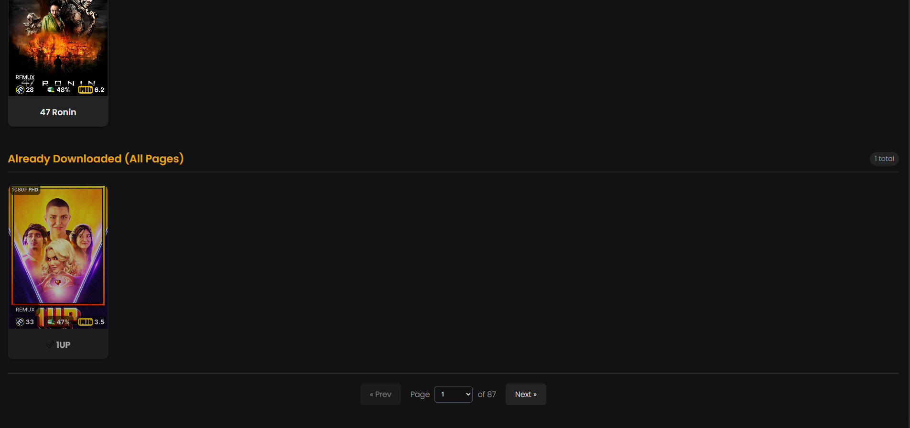
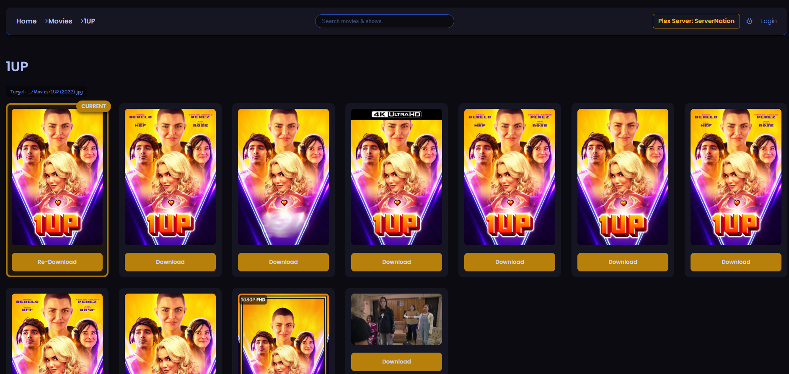
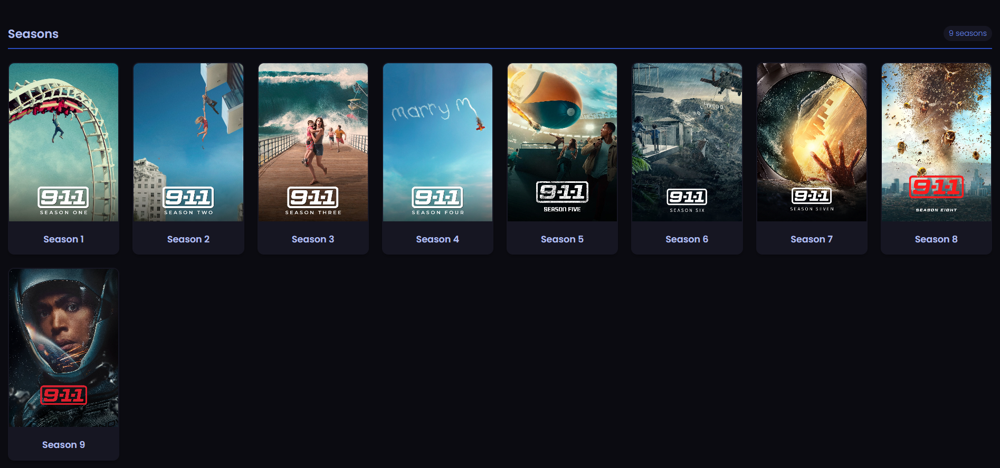
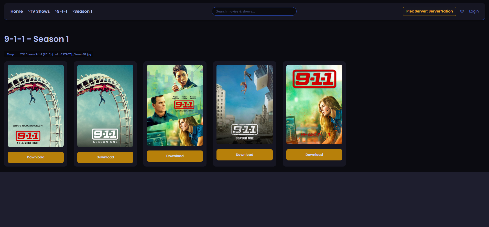

## 🎬 Plex Poster Downloader & Manager

A self-hosted web application that allows you to easily browse your Plex libraries and download local poster artwork (poster.jpg or asset-styled filenames) directly to your media folders.

This tool is perfect for users who want to switch to "Local Assets" agents, use tools like Kometa (formerly PMM), or simply want a backup of their curated artwork stored alongside their media files.

## ✨ Features

* **Plex-Themed Web UI:** A dark, responsive interface designed to feel like home for Plex users.

* **Flexible Asset Structures:** Support for both Asset Folders and Flat naming conventions.

* **Migration Tool:** Built-in utility to scan and convert your existing downloaded posters between folder structures.

* **Download Tracking:**

    * **Green (✅):** Poster already downloaded.

    * **Yellow (⚠️):** Partial download (e.g., Show has a poster but seasons are missing, or vice versa).

    * **Standard:** Poster missing.

* **Library Management:**

    * Supports Movies and TV Shows.

    * Paginated views for large libraries.

    * **Hidden Libraries:** Easily hide specific libraries (like 4K or Home Videos) via the Settings checklist.

* **Global Search:** Instantly search for movies or shows across all libraries with autocomplete suggestions.

* **Authentication:** Secure the interface with an admin username/password (can be disabled in Settings).

* **Manual Override:** Toggle items as "Complete" manually if you don't want to download a poster for them.

## **📷Screenshots**

* **Settings**




* **Homepage**


* **Library**


* **Posters**





## **🐳 Docker Installation (Recommended)**

The easiest way to run this application is using Docker.

# **Prerequisites**

  * **Docker**

  * **Docker Compose**

**1. Create Project Directory**

Create a folder on your server and place the ``compose.yaml`` file inside it.

**2. Configure Volumes**

Open ``compose.yaml`` and ensure the volumes map to your actual media folders.

```
services:
  plex-poster-downloader:
    image: ghcr.io/johnfawkes/plex-poster-downloader:latest
    container_name: plex-poster-manager
    restart: unless-stopped
    ports:
      - "5000:5000"
    volumes:
      # Stores config.json and download history
      - ./config:/app/config
      # If using with Kometa, change the first downloaded_posters to the asset directory for kometa
      - ./downloaded_posters:/app/downloaded_posters
    environment:
      - DATA_DIR=/app/config
```

**3. Run the Container**

```
docker-compose up -d
```

**4. Access the UI**

Open your browser and navigate to: ``http://localhost:5000``

## 🐍 **Manual Installation (Python)**

If you prefer running it directly on your host machine without Docker.

**Prerequisites**

  * Python 3.11 or higher

  * ``pip``

 **Steps**

  1. **Clone the Repository**

```
git clone https://github.com/johnfawkes/plex-poster-downloader.git
cd plex-poster-downloader
```

  2. **Install Dependencies**

```
pip install -r requirements.txt
```

***(Note: Create a virtual environment first if preferred)***

  3. **Run the Script**

```
python plex_poster_downloader.py
```

  4. **Access the UI** Open ``http://localhost:5000`` in your browser.

## **⚙️ Configuration**

On the first launch, you will be redirected to the Settings page.

  1. **Authentication:** You will be asked to create an Admin Username and Password.

  2. **Plex Connection:**

        * **Plex Server URL:** e.g., ``http://192.168.1.10:32400``

        * **Plex Token:** Your X-Plex-Token. [How to find your token.](https://support.plex.tv/articles/204059436-finding-an-authentication-token-x-plex-token/)

  3. **Download Directory:**

       * **Docker:** Leave as downloaded_posters (it maps to the internal path or).

       * **Manual:** Set this to the root of your media drive (e.g., ``Z:\Media`` or ``/mnt/media``, or where ever you want to save the posters. If you want to use it with Kometa then put the location of the assets path for kometa).

  4. **Hidden Libraries:** You can uncheck libraries you don't want to manage (e.g., Home Videos, Music).

## 📂 **Folder Structure Logic**

This tool supports two different naming conventions for saving posters. You can switch between them in Settings and use the Migrate Files tool to automatically reorganize your existing downloads.

1. **Asset Folders:**

    * **Movies:** ``[BaseDir]/Library Name/Movie Name/poster.jpg``

    * **Shows:** ``[BaseDir]/Library Name/Show Name/poster.jpg``

    * **Seasons:** ``[BaseDir]/Library Name/Show Name/Season01.jpg``

2. **No Asset Folders (Flat):**

    * **Movies:** ``[BaseDir]/Library Name/Movie Name.jpg``

    * **Shows:** ``[BaseDir]/Library Name/Show Name.jpg``

    * **Seasons:** ``[BaseDir]/Library Name/Show Name_Season01.jpg``

***Note: The script creates folders if they don't exist.***

## 🛠️ **Troubleshooting**

**Login loop or Session errors:**
The app generates a new secret key on every restart for security. If you restart the container, you will need to log in again.

## **Future Plans**

* Add support for titlecards
* Add support for logos
* Add support for backgrounds
* Maybe add manual upploading of assets to the webui for ease of use when you may not have access to the internal filesystem to place them manully
