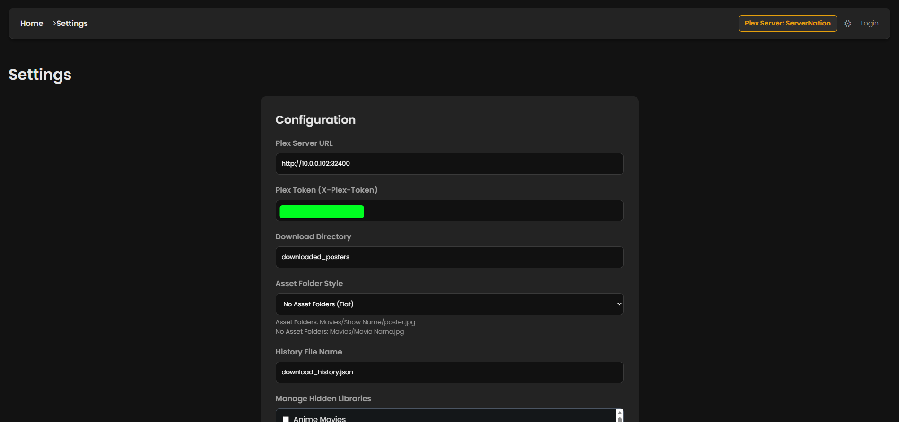
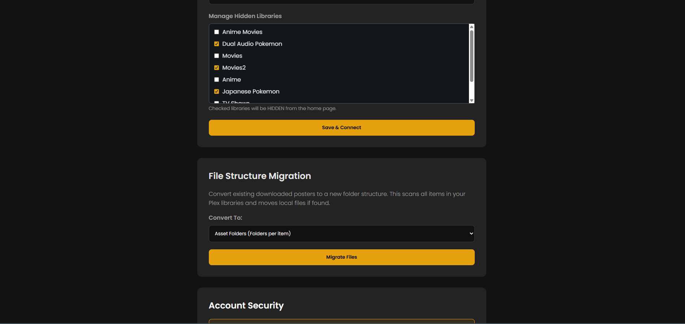
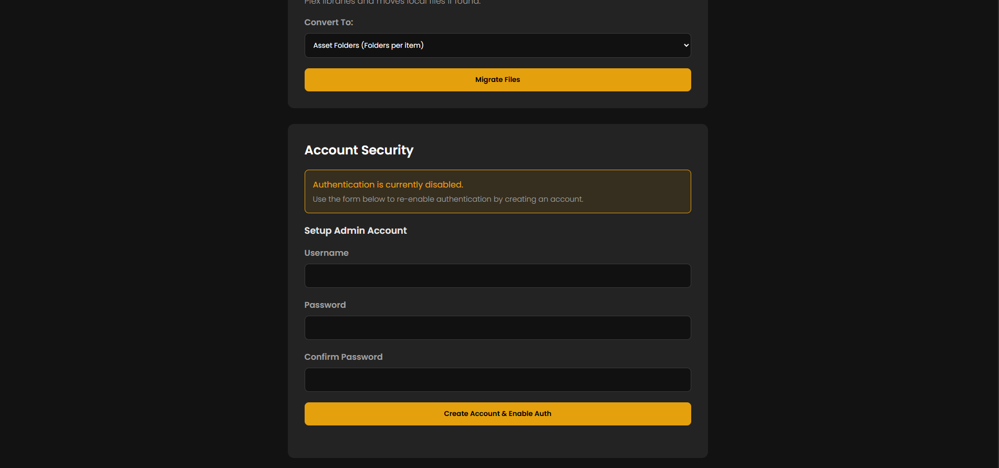
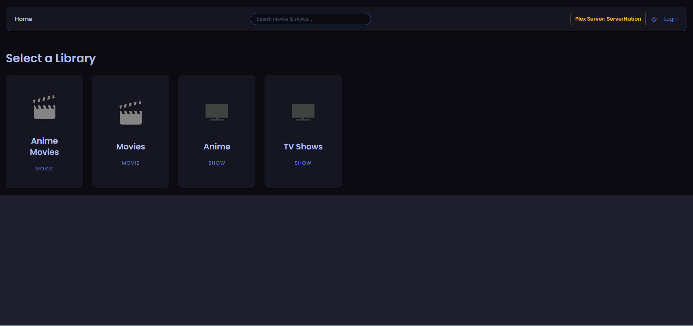
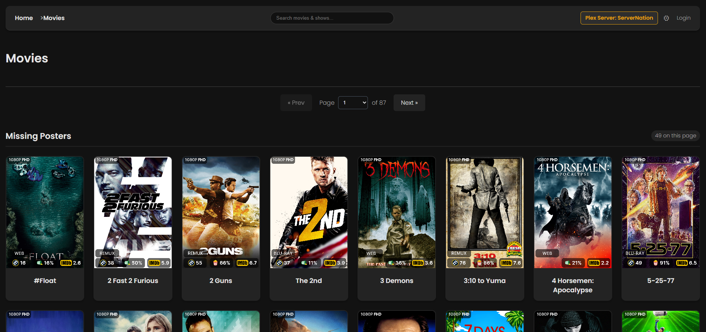
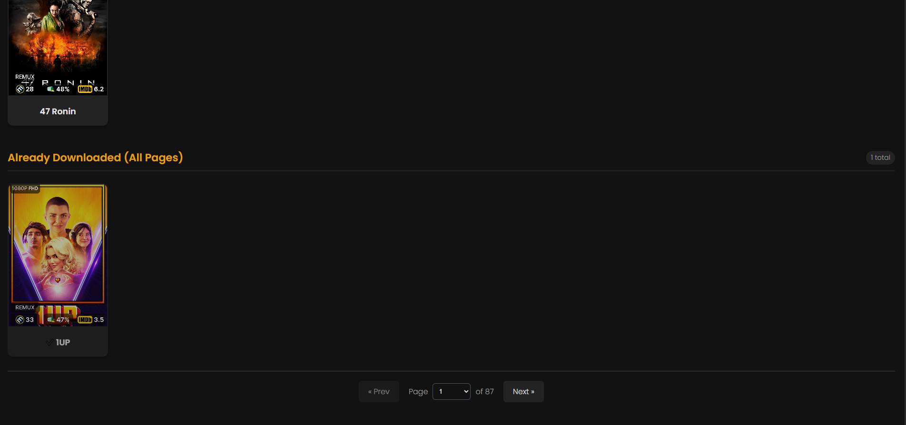
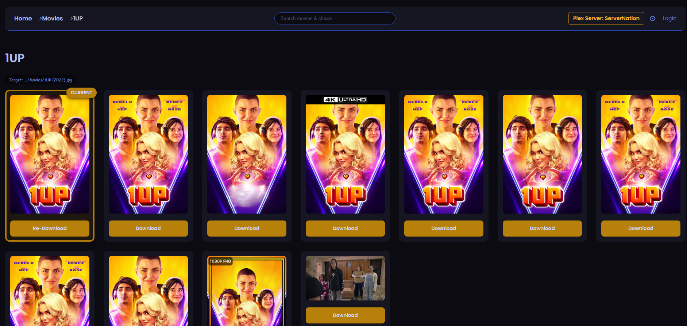
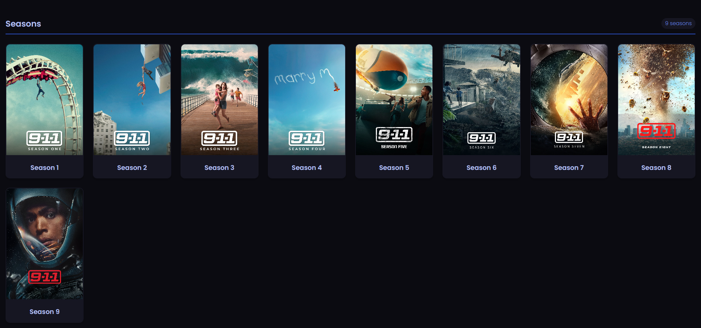
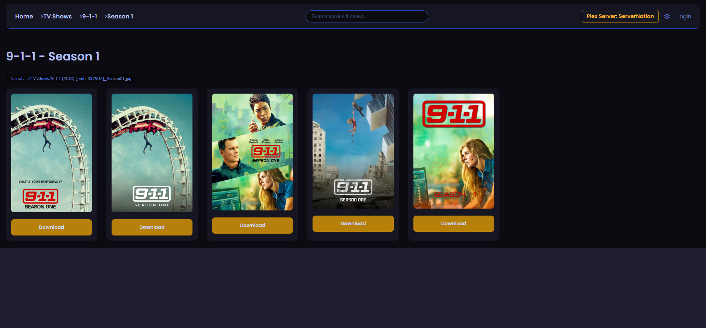

## 🎬 Plex Poster Downloader & Manager

A self-hosted web application that allows you to easily browse your Plex libraries and download local poster artwork (poster.jpg) and backgrounds (background.jpg) to any local folder.

This tool is perfect for users who want to switch to "Local Assets" agents, use tools like Kometa (formerly PMM), or simply want a backup of their curated artwork stored alongside their media files.

## **AI WARNING**
THIS SCRIPT WAS GENERATED USING GOOGLE GEMINI! I KNOW THIS CAN BE A TURN OFF FOR SOME BUT HAS BEEN TESTED AND WORKS GREAT! JUST GIVING THIS WARNING NOW AS I KNOW SOME DONT LIKE AI MADE SCRIPTS
YOU HAVE BEEN WARNED.

## ✨ Features

* **Plex-Themed Web UI:** A dark, responsive interface designed to feel like home for Plex users.

* **Global Search:** Instantly search for movies or shows across all libraries with autocomplete suggestions.

* **Background & Fanart Support:** Dedicated tabs to switch between Posters and Backgrounds.

    * Download high-res backgrounds for Movies, Shows, and Seasons.

    * Provider badges (TMDB, Fanart.tv, etc.) to see source quality.

* **Automated Scheduler (Cron):**

    * Schedule daily or weekly downloads (e.g., "Every Friday at 3:00 AM").

    * Choose specific libraries to target.

    * Modes: Random (fill missing spots), Specific Provider, or Random Provider.

    * Option to auto-download backgrounds alongside posters.

* **Flexible Asset Structures:** Support for both Asset Folders and Flat naming conventions.

* **Migration Tool:** Built-in utility to scan and convert your existing downloaded posters between folder structures.

* **Download Tracking:**

    * **Green (✅):** Poster already downloaded.

    * **Yellow (⚠️):** Partial download (e.g., Show has a poster but seasons are missing, or vice versa).

    * **Standard:** Poster missing.

* **Library Management:**

    * Supports Movies and TV Shows.

    * Paginated views for large libraries.

    * **Hidden Libraries:** Easily hide specific libraries (like 4K or Home Videos) via the Settings checklist.

* **Authentication:** Secure the interface with an admin username/password (can be disabled in Settings).

* **Manual Override:** Toggle items as "Complete" manually if you don't want to download a poster for them.

## **📷Screenshots**

* **Settings**




* **Homepage**


* **Library**


* **Posters**





## **🐳 Docker Installation (Recommended)**

The easiest way to run this application is using Docker.

# **Prerequisites**

  * **Docker**

  * **Docker Compose**

**1. Create a project directory**

Create a folder on your server and download `compose.yaml` and `.env.example` into it.

**2. Create your `.env` file**

Copy the example file and fill in at minimum your Plex URL and token:

```
cp .env.example .env
```

Then open `.env` and set:

```
PLEX_URL=http://192.168.1.100:32400
PLEX_TOKEN=your-plex-token-here
```

All other settings have sensible defaults. See `.env.example` for the full list of options — everything configurable in the WebUI can also be set here.

**3. Run the container**

```
docker compose up -d
```

**4. Access the UI**

Open your browser and navigate to: ``http://localhost:5000``

On first launch you will be prompted to create an admin username and password.

> **Tip — Kometa users:** Set `DOWNLOAD_BASE_DIR` in your `.env` to point at the Kometa asset directory so posters land exactly where Kometa expects them.

## 🐍 **Manual Installation (Python)**

If you prefer running it directly on your host machine without Docker.

**Prerequisites**

  * Python 3.11 or higher

  * ``pip``

 **Steps**

  1. **Clone the Repository**

```
git clone https://github.com/johnfawkes/plex-poster-downloader.git
cd plex-poster-downloader
```

  2. **Install Dependencies**

```
pip install -r requirements.txt
```

***(Note: Create a virtual environment first if preferred)***

  3. **Run the Script**

```
python plex_poster_downloader.py
```

  4. **Access the UI** Open ``http://localhost:5000`` in your browser.

## **⚙️ Configuration**

There are two ways to configure the app — use whichever suits your workflow:

**Option A — `.env` file (recommended for new installs)**

Set your values in `.env` before starting the container. Environment variables always take precedence over `config.json`, so the app is ready to go with no WebUI interaction needed.

| Variable | Description | Default |
|---|---|---|
| `PLEX_URL` | Base URL of your Plex server | `http://127.0.0.1:32400` |
| `PLEX_TOKEN` | Your X-Plex-Token ([how to find it](https://support.plex.tv/articles/204059436)) | — |
| `DOWNLOAD_BASE_DIR` | Where posters are saved | `/app/downloaded_posters` |
| `ASSET_STYLE` | `ASSET_FOLDERS` or `PLEX_FOLDERS` | `ASSET_FOLDERS` |
| `AUTH_DISABLED` | `true` to skip login (trusted networks only) | `false` |
| `CRON_ENABLED` | Enable scheduled downloads | `false` |
| `CRON_TIME` | Schedule time (24 h `HH:MM`) | `03:00` |
| `CRON_DAY` | `DAILY` or a weekday name | `DAILY` |
| `CRON_TZ` | Timezone (e.g. `America/New_York`) | `Local` |
| `CRON_PROVIDER` | Preferred provider (`tmdb`, `tvdb`, …) | `tmdb` |
| `IGNORED_LIBRARIES` | Comma-separated library names to skip | — |

See `.env.example` for the full list with descriptions.

**Option B — WebUI Settings page**

On first launch you will be redirected to the Settings page.

  1. **Authentication:** You will be asked to create an Admin Username and Password.

  2. **Plex Connection:**

        * **Plex Server URL:** e.g., ``http://192.168.1.10:32400``

        * **Plex Token:** Your X-Plex-Token. [How to find your token.](https://support.plex.tv/articles/204059436-finding-an-authentication-token-x-plex-token)

  3. **Hidden Libraries:** You can uncheck libraries you don't want to manage (e.g., Home Videos, Music).

## 📂 **Folder Structure Logic**

This tool supports two different naming conventions for saving posters. You can switch between them in Settings and use the Migrate Files tool to automatically reorganize your existing downloads.

1. **Asset Folders:**

    * **Movies:** ``[BaseDir]/Library Name/Movie Name/poster.jpg``

    * **Shows:** ``[BaseDir]/Library Name/Show Name/poster.jpg``

    * **Seasons:** ``[BaseDir]/Library Name/Show Name/Season01.jpg``

2. **No Asset Folders (Flat):**

    * **Movies:** ``[BaseDir]/Library Name/Movie Name.jpg``

    * **Shows:** ``[BaseDir]/Library Name/Show Name.jpg``

    * **Seasons:** ``[BaseDir]/Library Name/Show Name_Season01.jpg``

***Note: The script creates folders if they don't exist.***

## 🛠️ **Troubleshooting**

**Login loop or Session errors:**
The app generates a new secret key on every restart for security. If you restart the container, you will need to log in again.

## **Future Plans**

* Add support for titlecards
* Add support for logos
* Add Squareart support
* ~~Add support for backgrounds~~
* Maybe add manual upploading of assets to the webui for ease of use when you may not have access to the internal filesystem to place them manully
* Add a viewer for just the locally downloaded posters. Seperate it out from the downloader
